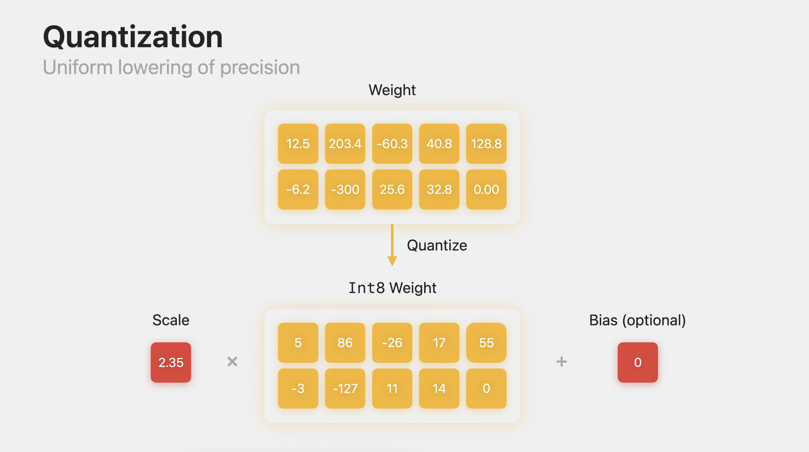

# audio-to-image

Overview of project:
This repository provides an audio-to-image synthesis pipeline through a Bash script by utilizing multiple open-source libraries: FFmpeg, Whisper, and Stable Diffusion to create a Bash pipeline for audio-to-image synthesis. Users can select a time window within which they propose an image prompt, after which a 512x512 image will be output. This repository is currently compatible with MacOS but alternative technologies exist for Windows and Linux. The modular build allows for plug-and-play functionality with OS-specific technologies.

At each stage are instructions on installing the technologies and a brief overview of their functional modularity. If you're not interested, feel free to skip to the shortcut section and read about how shortcut_install.sh can install all the technologies for you.

## FFmpeg

The first step for a functioning audio-to-image pipeline is the recording software. This repository expects the utilization of FFmpeg, but feel free to swap this for your own software. [Here's the installation guide I used](https://phoenixnap.com/kb/ffmpeg-mac). FFmpeg is free and open-source, offering multiple libraries for handling video and audio files. It's truly a Swiss Army knife for transcoding, editing, and standards compliance for a variety of multimedia files. With this pipeline we'll be using just one of the tools. Make sure to play around with some of the other FFmpeg capabilities when you get a chance!

As mentioned, this is the first step in building our audio-to-image pipeline. The FFmpeg command in our shell file utilizes the on-device microphone (-i ":0") to create a listening window at 16kHz (-ar 16000) for 10 seconds (-t 10) before saving the resultant .wav file to our specified directory. The listening frequency and file extension are particularly important, as this pipeline is built for Macs and the next module is dependent on these specifics for functionality.

## Whisper

Our next component is an Apple Silicon first-class citizen version of OpenAI's automatic speech recognition model: Whisper. Whisper offers state-of-the-art audio transcription performance and with a variety of model sizes, it is customizable to fit your device's memory capabilities. Fair warning: model performance is tied to model size, so although smaller models offer memory resource savings, they may also struggle with some transcription tasks, potentially leading to a downstream deprecation in generated image quality. All instructions on downloading the Whisper model and further details on its capabilities can be found [here](https://github.com/ggerganov/whisper.cpp).

OpenAI's Whisper model comes in a variety of sizes with varying layer, head, width, and parameter sizes (e.g. Medium: 6-layers, 1024-wide, 16-heads, consisting of 769M parameters in total). The models break audio into 25ms windows with a stride of 10ms. It utilizes log-magnitude Mel spectrograms to analyze audio recordings for transcription. For a deeper dive into the Whisper model, check out the Whisper.md file in the models_explained folder [linked here](https://github.com/ejohansson13/concepts_explained/tree/main/Whisper). Make sure to visit the [home page](https://github.com/ejohansson13/concepts_explained/tree/main) of the repository to understand the layout.

Whisper is used for audio transcription from the .wav file produced in our audio recording stage and outputs a .txt file which is then employed as our text-to-image synthesis prompt. This may feel like using a sledgehammer to open a pickle jar, but Whisper's robustness, accuracy, and out-of-the-box readiness make it an easy plug-and-play tool for our audio-to-image pipeline. Feel free to try other ASR models that better fit your needs! Whisper's high attention-to-detail means that absences of audio before the end of the 10-second audio recording window will often be annotated by [BLANK AUDIO] or (background music). To prevent this from polluting our image synthesis prompt, we run remove_parentheses.py between our Whisper and Stable Diffusion stages.

## Stable Diffusion

Lastly, we arrive at the engine of our pipeline: Stable Diffusion. Responsible for our image generation functionality, Stable Diffusion has been heavily popularized by allowing users to generate customized images with descriptive text prompts. Multiple Stable Diffusion model versions exist and this pipeline was developed with Stable Diffusion 2.1, but feel free to select whichever model version you prefer! Instructions on downloading an Apple Silicon-friendly version of Stable Diffusion can be found here: https://github.com/apple/ml-stable-diffusion. After downloading the Core ML framework from Apple's repository, downloading a specific model is required. If you're comfortable running image synthesis with SD2.1, check out download_model.py. If you want to explore some other options, [this is a useful resource](https://huggingface.co/blog/diffusers-coreml) for selecting and downloading your chosen inference model. If you're concerned with the memory costs associated with these models, check out the [Quantization and Palettization](#quantization-and-palettization) section for memory optimization.

Stable Diffusion employs Latent Diffusion Models in concert with pre-trained open-source text encoders. Latent diffusion models learn through deconstruction of their training images how to construct new image concepts from white noise. Text prompts can then condition the image generation process via a cross-attention mechanism. The CLIP architecture used for our text encoder differs from previous text encoders by jointly utilizing text and image embeddings to learn the correct pairings for image-text training examples. For more information on Stable Diffusion, check out [this resource](https://github.com/ejohansson13/concepts_explained/tree/main/Stable%20Diffusion), or if you want to learn about CLIP, [click here](https://github.com/ejohansson13/concepts_explained/tree/main/CLIP).

Stable Diffusion is ultimately responsible our image generation. Until now, our pipleline has been focused on easing the user's prompting responsibility and transcribing our audio to an understandable medium for our image generation model. Unlike Stable Diffusion XL, SD2.1 and earlier versions' image qualities are tightly correlated with the descriptiveness of the prompt. Keep that in mind when speaking your chosen prompt. If using SDXL, be aware of the longer runtime especially with first generation Apple Silicon. If you're interested in reading more about Stable Diffusion XL and its distinction from previous stable diffusion models, check out [this resource](https://github.com/ejohansson13/concepts_explained/tree/main/Stable%20Diffusion%20XL). Stable Diffusion quickly grew to immense popularity for its unlocking of abstract concepts and grasp of differing artistic styles. Popularizing text-to-image synthesis unlocked a new medium for artists to quickly audit conceptual art or serve as a springboard for future inspiration. Whatever your reason for this pipeline, I hope you enjoy these amazing technologies and benefit from their open-source access!

#### Quantization and Palettization

Keeping an eye on the growing memory needs of machine learning applications, Apple designed new tools for lossy model compression. [This video](https://developer.apple.com/videos/play/wwdc2023/10047/) covers it in fantastic detail, but I'll give a short overview. At every layer of these giant neural networks, each parameter holds a very specific weight. These weights are either stored in half-precision floating-point memory (fp16) or single-precision floating-point (fp32). Each fp16 weight is 16 bits or 2 bytes (fp32 is double the size). Stable Diffusion 2.1 has about 860 million parameters. At 2 bytes/parameter, we have a 1.6GB model, a significant chunk of memory. To compensate for these increasing memory costs associated with machine learning models, Apple introduced two new techniques, quantization and palettization.

Quantization uses a multiplier and optional bias to shrink the number of bits required in storing numbers. If we want to condense our memory representation of 203.4, we can use an int representation and scale. 203.4 becomes 86 with a scale of 2.35. Our scale and int value can later dequantize our weights. Some precision is lost in this approximation, but it significantly minimizes our information needed to store these weights. Quantization is a uniform lowering of precision and can halve the memory associated with our model. This is fantastic from a memory conservation perspective, but performance is dependent on weights' survivability in being reduced.

  

Palettization is a non-uniform lowering of precision and can decrease our memory requirements up to 8x. It uses clustering to represent similar values with a cluster centroid value. We can then store the centroid values in a lookup table. Our matrix of weights is replaced with n-bit values containing the respective weights' indices in the lookup table. In the example below, we can cluster 6.2, 6.6, 6.8, 6.9, and 6.3 and represent them with a centroid value of 6.5. Their matrix indices can then be replaced with the lookup table index 00 representing their centroid value. This becomes especially important as we scale up the precision of our weights and allows us to significantly reduce their memory footprint. Representing 16-bit weights with 2-bit palettization can offer immense memory savings with manageable performance tradeoffs.

  

If you're interested in reading more about utilizing quantization/palettization to decrease memory costs associated with Stable Diffusion models, make sure to check out Pedro Cuenca's Hugging Face blogs on the topics, they're an invaluable resource. In particular, he highlights how image inference [can be sped up](https://huggingface.co/blog/fast-diffusers-coreml) with palettization and how [mixed-bit palettization](https://huggingface.co/blog/stable-diffusion-xl-coreml) can actually optimize SDXL inference times.

# Shortcut

Check out the associated shortcut_install.sh bash file for all of the associated commands that will be installed. Double check that you do not already have these technologies downloaded. Feel free to selectively download the packages you need to run the pipeline. 

Provide bash script to install all above technologies sequentially

You can check if you already have homebrew installed by typing "brew update" into your Terminal command line. If you receive an error such as 

You can check if you already have git installed by typing "git --version" into your Terminal command line.

Check if you have Anaconda previously installed. Necessary for creating virtual environment to run pipeline

#### Disclaimer

Please keep in mind general ethical and safety guidelines when utilizing any image generation technology. If you have any questions, OpenAI's [usage policies](https://openai.com/policies/usage-policies) are a good place to start. 

#### Sources
[1] https://en.wikipedia.org/wiki/
[2] https://developer.apple.com/videos/play/wwdc2023/10047/
