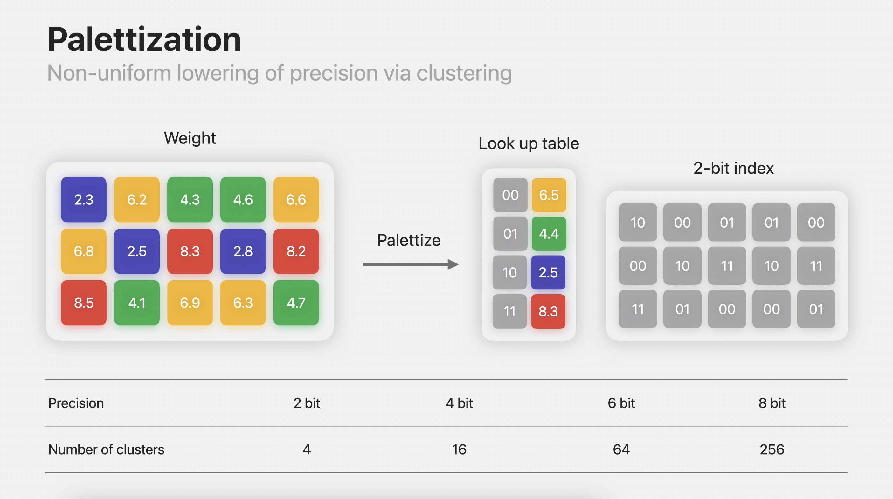

# audio-to-image

This repository provides an audio-to-image synthesis pipeline with a Bash script utilizing multiple open-source libraries: FFmpeg, Whisper, and Stable Diffusion. Users can select a time window within which they propose an image prompt, after which a 512x512 image will be output. This repository is currently compatible with MacOS but alternative technologies exist for Windows and Linux.

At each stage are instructions on installing the technologies and a brief overview of their functional modularity. If you're not interested, feel free to skip to the shortcut section and read about how shortcut_install.sh can install all the technologies for you.

## FFmpeg

The first step for a functioning audio-to-image pipeline is the recording software. This repository expects the utilization of FFmpeg, but feel free to swap this for your own software. [Here's the installation guide I used](https://phoenixnap.com/kb/ffmpeg-mac). FFmpeg is free and open-source, offering multiple libraries for handling video and audio files.

This is the first step in building our audio-to-image pipeline. The FFmpeg command in our shell file utilizes the on-device microphone (-i ":0") to create a listening window at 16kHz (-ar 16000) for 10 seconds (-t 10) before saving the resultant .wav file to our specified directory. If you want to announce a longer prompt for image synthesis, feel free to extend the listening window for more time. The listening frequency and file extension are particularly important for Macs and the next module is dependent on these specifics for functionality.

## Whisper

Our next component is an Apple Silicon first-class citizen version of OpenAI's automatic speech recognition model: Whisper. Whisper offers state-of-the-art audio transcription performance and with a variety of model sizes, it is customizable to fit your device's memory capabilities. Fair warning: model performance is tied to model size. Smaller models save memory, but may struggle with some transcription tasks, deprecating image quality downstream. All instructions on downloading the Whisper model and further details on its capabilities can be found [here](https://github.com/ggerganov/whisper.cpp).

OpenAI's Whisper model comes in a variety of sizes with varying layer, head, width, and parameter sizes (e.g. Medium: 6-layers, 1024-wide, 16-heads, consisting of 769M parameters in total). The models break audio into 25ms windows with a stride of 10ms. It utilizes log-magnitude Mel spectrograms to analyze audio recordings for transcription. For a deeper dive into the Whisper model, check out the repository I wrote explaining the technology and coding it from scratch (link will be attached in the future).

Whisper transcribes the audio from the .wav file produced in our recording stage and outputs a .txt file which is then employed as our text-to-image synthesis prompt. Whisper's speed, robustness, and accuracy make it an easy tool for our audio-to-image pipeline. However, if you prefer another ASR model feel free to exchange it for Whisper in the pipeline. Whisper's high attention-to-detail means that absences of audio before the end of the 10-second audio recording window will often be annotated by [BLANK AUDIO] or (background music). To prevent this from polluting our image synthesis prompt, we run remove_parentheses.py between the Whisper and Stable Diffusion stages.

## Stable Diffusion

Lastly, we arrive at the engine of our pipeline: Stable Diffusion. Responsible for our image generation functionality, Stable Diffusion has been heavily popularized by allowing users to generate customized images with descriptive text prompts. Multiple Stable Diffusion model versions exist and this pipeline was developed with Stable Diffusion 2.1, but you can choose whichever model version you prefer! Instructions on downloading an Apple Silicon-friendly version of Stable Diffusion can be found [here](https://github.com/apple/ml-stable-diffusion). After downloading the Core ML framework from Apple's repository, downloading a specific model is required. If you're comfortable running image synthesis with SD2.1, check out download_model.py. If you want to explore some other options, [this is a useful resource](https://huggingface.co/blog/diffusers-coreml) for selecting and downloading your chosen inference model. If you're concerned with the memory costs associated with these models, check out the [Quantization and Palettization](#quantization-and-palettization) section for memory optimization.

Stable Diffusion employs Latent Diffusion Models in concert with pre-trained open-source text encoders. Latent diffusion models deconstruct training images to learn how to construct new image concepts from white noise. Text prompts can then condition the image generation process via cross-attention. The CLIP architecture used for our text encoder differs from previous text encoders by jointly utilizing text and image embeddings to learn the correct pairings for image-text training examples. For more information on Stable Diffusion, check out [this resource](https://github.com/ejohansson13/concepts_explained/tree/main/Stable%20Diffusion), or if you want to learn about CLIP, [click here](https://github.com/ejohansson13/concepts_explained/tree/main/CLIP).

Unlike Stable Diffusion XL, the performance of SD2.1 and earlier versions are highly correlated with prompt descriptiveness. Keep that in mind when vocalizing your prompt. If using SDXL, be aware of the longer runtime especially with first generation Apple Silicon. Stable Diffusion grew to immense popularity for its democratization of abstract image synthesis. Popularizing text-to-image synthesis unlocked a new medium for artists to quickly audit conceptual art and an experimental avenue for inspiration.

#### Quantization and Palettization

Keeping an eye on the growing memory needs of machine learning applications, Apple designed new tools for lossy model compression. [This video](https://developer.apple.com/videos/play/wwdc2023/10047/) covers it in fantastic detail, but I'll give a short overview. At every layer of large neural networks, the parameters within the layer hold a specific weight. These weights are stored in either half-precision floating-point memory (fp16) or single-precision floating-point (fp32). Each fp16 weight is 16 bits or 2 bytes (fp32 is double the size). Stable Diffusion 2.1 has about 860 million parameters. At 2 bytes/parameter, we have a 1.6GB model, a significant chunk of memory. To compensate for the increasing memory costs associated with machine learning models, Apple introduced two new techniques, quantization and palettization.

Quantization uses a multiplier and optional bias to shrink the number of bits required in storing numbers. If we want to condense our memory representation of 203.4, we can use an int representation and scale. 203.4 becomes 86 with a scale of 2.35. Our scale and int value can later dequantize our weights. Some precision is lost in this approximation, but it significantly minimizes the information needed to store these weights. Quantization is a uniform lowering of precision and can halve the memory associated with the model. This is fantastic from a memory conservation perspective, but performance is dependent on the survivability of weights after being reduced.
<p align="center" width="100%">
  

Palettization is a non-uniform lowering of precision and can decrease memory requirements up to 8x. It uses clustering to represent similar values with a cluster centroid value. We can then store the centroid values in a lookup table. Our matrix of weights is replaced with n-bit values containing the respective weights' indices in the lookup table. In the example below, we can cluster 6.2, 6.6, 6.8, 6.9, and 6.3 and represent them with a centroid value of 6.5. Their matrix indices can then be replaced with the lookup table index 00 representing their centroid value. This becomes especially important as we scale up the precision of our weights and allows a significant reduction in the memory footprint size. Representing 16-bit weights with 2-bit palettization can offer immense memory savings with manageable performance tradeoffs.
<p align="center" width="100%">
  

If you're interested in reading more about utilizing quantization/palettization to decrease memory costs associated with Stable Diffusion models, make sure to check out Pedro Cuenca's Hugging Face blogs on the topics. In particular, he highlights how image inference [can be sped up](https://huggingface.co/blog/fast-diffusers-coreml) with palettization and how [mixed-bit palettization](https://huggingface.co/blog/stable-diffusion-xl-coreml) can actually optimize SDXL inference times.

# Setup

### Setting Up Conda Environment:

The first step is installing the above open-source libraries: FFmpeg, Whisper (Apple Silicon port), and Apple’s CoreML Stable Diffusion repository. You can revisit each section above to determine how to do so. Next, you’ll want to double check you have miniconda downloaded. Navigate to your terminal, and type the following command:

```
conda --version
```

If the above command shows “conda command is not recognized”, you’ll need to [download miniconda](https://docs.anaconda.com/miniconda/miniconda-install/). Once you have miniconda on your machine, we can get started creating our local environment for the audio to image synthesis pipeline. Run the following commands in order:

```
conda create -n audio2image python=3.9.17 -y

conda activate audio2image

pip install -r requirements.txt
```

Feel free to change “audio2img” to any other preferred environment name. We now have a local environment for image generation. We can exit the environment with the below command:

```
conda deactivate
```

### Setting Up Working Directory:

At this point, we should have FFmpeg installed and the Whisper and CoreML Stable Diffusion repositories pulled locally. We should also now have a functioning local conda environment to run our pipeline. Let’s organize our directories, so they’re locally accessible for our Shell script (this is optional, you can also use absolute paths to access the different pipeline components). 

<p align="center" width="100%">
  
</p>

After pulling the whisper.cpp repository, we can nestle it inside of the coreml_stable_diffusion_main repository, along with our three output folders: Images, Recordings, Text. This is the expected directory layout for the run_project.sh file. Feel free to change your directory layout, but make sure to update the corresponding commmands in the shell file. 

#### Disclaimer

Please keep in mind general ethical and safety guidelines when utilizing any image generation technology. OpenAI's [usage policies](https://openai.com/policies/usage-policies) are a good place to start. 


#### Sources
[1] https://phoenixnap.com/kb/ffmpeg-mac

[2] https://github.com/ggerganov/whisper.cpp

[3] https://cdn.openai.com/papers/whisper.pdf

[4] https://github.com/apple/ml-stable-diffusion

[5] https://arxiv.org/pdf/2112.10752

[6] https://developer.apple.com/videos/play/wwdc2023/10047/
